根據在牛津英語辭典（Oxford English Dictionary）上查到關於 Stack 這個字的解釋：

> **Stack** /stæk/  
> a pile of something, usually neatly arranged

Stack 用來表示一堆東西，通常會整齊排列。而 Heap 的解釋是：

> **Heap** /hiːp/  
> an untidy pile of something

同樣也是表示一堆東西，但跟整齊排列的 Stack 不同，Heap 是一堆相對比較凌亂的東西。


Stack
-----

Stack 是一連串連續的記憶體，我們可以先把它想像成這樣：

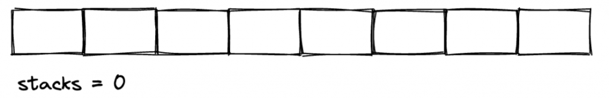

通常畫 Stack 的時候我會直著畫，像疊盤子一樣比較容易想像「先進後出（First In, Last Out）」的情境，但因為直著畫排版上篇幅會被拉長，所以我就讓這個 Stack 先躺著休息一下。

為了簡化情境，我們先假設在執行程式的之前這個 Stack 上面一開始什麼都沒有。接著我們來看一段簡單的程式碼：

```rust
fn main() {
    draw(9527);
}

fn show_lotteries(n1: i32, n2: i32, n3: i32) {
    println!("the lottery numbers are {} {} {}", n1, n2, n3);
}

fn draw(num: i32) {
    show_lotteries(num + 1 , num + 5, num + 10);
}

```

上面這幾個函數不算太複雜，大概就是個簡單的抽獎程式（？）。根據各位以往在寫網頁程式的經驗，當執行到 `draw(9527)` 的時候，你大概猜的出來就是把 `9527` 這個數字傳進去。以比較高階的角度來看是這樣沒錯，但事實上程式的執行的時候，會把 `9527` 這個引數擺在 Stack 上，就像這樣子：

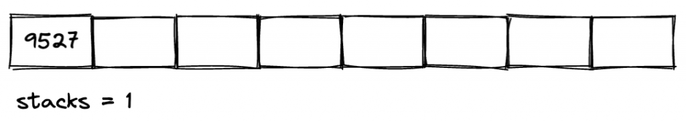


這時候的 Stack 的使用量是 1。接著，當進到 `draw` 函數裡繼續執行到 `show_lotteries` 函數的時候，它會去 Stack 上面拿最後面那格記憶體的資料來用，也就是 `9527`，接著把它分別 +1、+5 及 +10 之後代入 `show_lotteries` 函數。同樣的概念，這時候這 3 個數值會被繼續堆到 Stack 上，看起來像這樣：

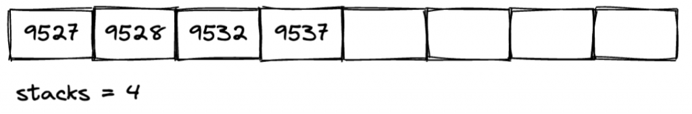

這時候 Stack 上面就堆了 4 格了。在 `show_lotteries` 裡把數字印出來之後，`9528`、`9532`、跟 `9537` 這 3 個數字就用不到了，這時候並不會把這 3 格記憶體內容清掉，而只是先把 Stack 的使用量標記成 1，而且把那 3 格記憶體標記成「這個格子我沒有要用了，看有誰需要就自己拿去用」：

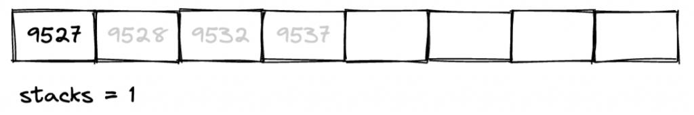

再來，`draw` 函數做完也準備退場了，同樣的也會把 Stack 的使用量標記成 0，並且把格子讓出來：

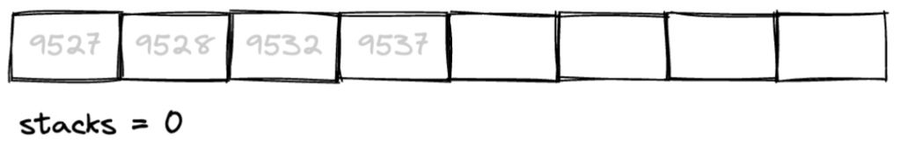

Stack 主要的用途除了用來存放執行函數時候的參數外，還可以用來放回傳值，例如這樣：

```rust
let result = add(3, 8);

fn add(n: i32, m: i32) -> i32 { n + m }

```

這裡我假設程式可能已經執行一段時間，因為來來回回的使用記憶體，所以記憶體格子可能已經沒有那麼乾淨：

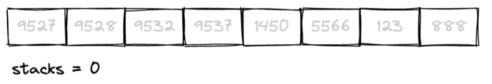

雖然這些記憶體格子是二手的，但還是可以用，基本上也沒什麼問題。執行第一行程式的時候，一樣會把 `3` 跟 `8` 擺上去，只是擺放的位置會有些不同：

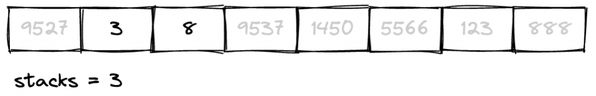

這裡會把第一格先空下來，因為 Rust 知道待會執行 `add` 函數的時候會回傳 1 個 `i32` 的值回來，所以就先預留第一格。`add` 函數執行結束後就會把回傳結果 `11` 擺在第 1 格，並且放掉原本佔用的第 2 格及第 3 格：

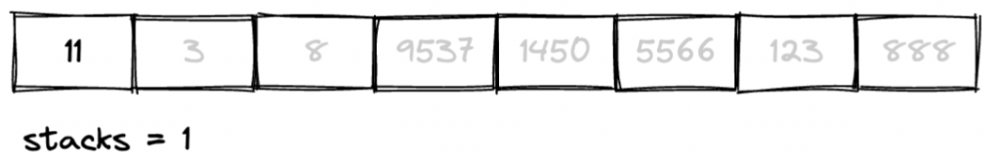

如果你寫的函數的回傳值是多個值，例如會回傳一個內容物是 3 個值 的 Tuple 的話，這時候就會幫你保留 3 個空格給你放回傳值。簡單的說，Stack 主要的用途是用來存放呼叫函數時候的參數以及回傳值。

我們到目前提到的資料型態都像是數字、布林值或是 Tuple 這種比較固定的，但如果回傳的結果是可以變動的呢？我們先來介紹一下在 Rust 裡面也很常用到的一種結構，向量（Vector）。

在 Rust 裡的陣列（Array）是固定不可修改的，有時候不是那麼好用，如果你希望有跟陣列類似的結構，但可以像在 JavaScript 裡的那種陣列可以任意新增或刪除元素的話，那你可以使用 Vector：

```rust
let mut list = vec![1, 2, 3];
list.push(4);

println!("{:?}", list);  // 印出 [1, 2, 3, 4]

```

宣告 Vector 的方式有好幾種方式，其中一種方式就是使用 `vec!` 巨集來宣告，再搭配 `mut` 就可以做出類似陣列但可以變動的結構，這個用起來就比較接近大家平常在寫的 JavaScript 的陣列。Vector 雖然可以動態新增或刪除元素，但它還是得都放同一個型態。

回到剛剛的 Stack 主題，如果回傳值是像 Vector 這種可能會變動的，或是比較複雜的資料型態，它可能會一直需要更多的記憶體格子，那你要幫它留幾個格子？你會發現給它幾格都不太對，因為它可能在使用的過程會不斷的更動，你可能得給它更多的格子。Stack 的結構看起來就有點不適合做這件事了，雖然還是可以空個格子出來放，但只會放個類似像索引或指標之類的東西，真正的資料內容會擺放到 Heap 上。


Heap
----

跟 Stack 一樣，Heap 也是一堆記憶體空間的格子，不同的是就如它字面所解釋，它的結構比較散亂一些。

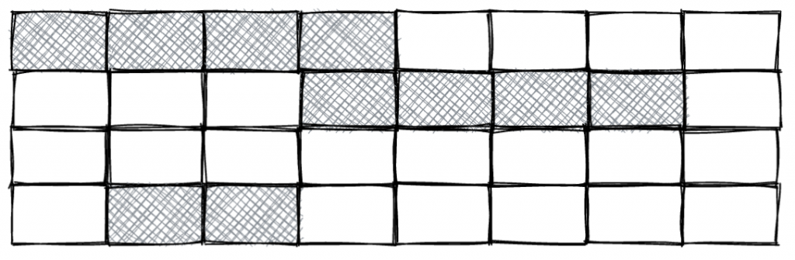

標記灰色的區域表示可能已經被其它資料給佔用，目前無法使用。接著，假設我有一個可以 `mut` 的 Vector 像這樣：

```rust
let mut numbers = vec![1, 3, 5, 8, 10];
```


Rust 就會試著去找看看有沒有能夠放 5 個 `i32` 的連續空格，如果找到就把這個格子預訂下來給這個 Vector 用：

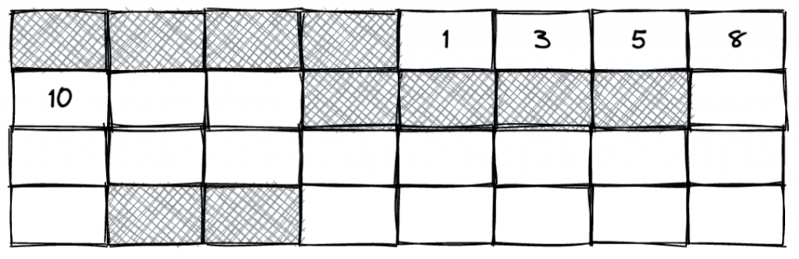

看來裝的下，沒問題。接著我再做 2 次的 `push`：

```rust
numbers.push(20);
numbers.push(25);
```

先假設這時候後面兩個格子還沒有被其它資料佔用，這時候 Heap 可能會變成這樣：

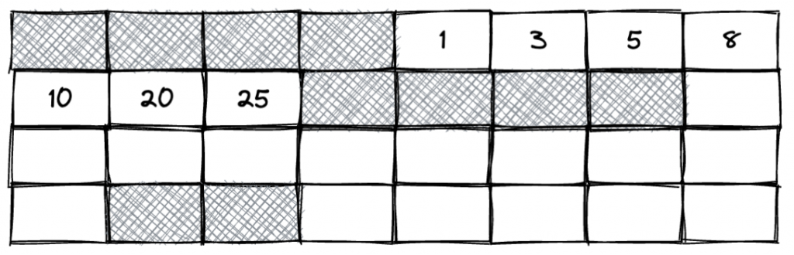


還行還行，還裝的下。但如果再 `push` 一下呢？

```rust
numbers.push(1450);

```

雖然 Vector 是可以變動的，但它也是連續的記憶體，格子明顯塞不下了，這時候 Rust 就會試著去找更大的空間...就發現後面好像有一塊比較空的，就會把原本的 Vector 搬一份過去，並且把新的 `1450` 加上去，然後原本的空格就會把它標記成讓出來給別人用：

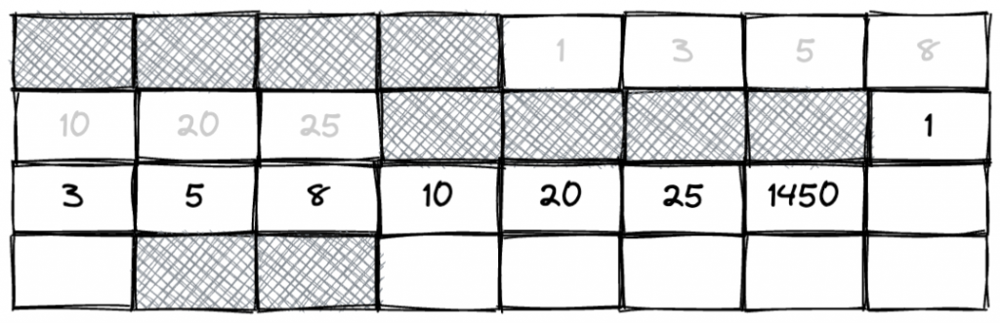

假設如果有一天又滿了怎麼辦？就再找更大的空間來擺，就這樣逐水草而居。就是因為常常這樣需要搬家，所以效能上就不會像陣列那麼快。

是說，大家有在圖書館或麥當勞看過有些人會用包包或外套等東西幫朋友佔位置的嗎？這樣的行為其實不太好，但其實 Vector 也會幹類似的事。以 `vec![1, 2, 3]` 來說，一開始它會向 Heap 要 3 個連續的空格，這沒問題，因為你們就 3 個元素：

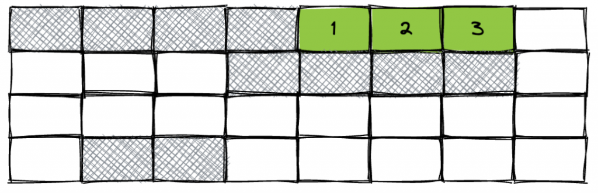

但如果 `push` 之後呢？就跟只 Heap 要 4 個連續的空格嗎？還是會先用外套先多佔幾格起來比較保險？如果先多佔幾個位置，雖然現在可能還沒用到，但待會要用的時候，就不用擔心後面的空白被其它程式或資料給佔走了。

Vector 有兩個跟空間大小有關的方法，一個是 `.len()`，它會印出這個 Vector 的元素個數；另一個是 `.capacity()`，它則是會印出這個 Vector 的「容量」。這個容量跟元素個數有什麼不同？我們直接看看底下這段範例：

```rust
fn main() {
    let mut numbers = vec![1, 2, 3];
    println!("{}, {}", numbers.len(), numbers.capacity());  // 3, 3

    numbers.push(1);
    println!("{}, {}", numbers.len(), numbers.capacity());  // 4, 6

    numbers.push(1);
    numbers.push(1);
    println!("{}, {}", numbers.len(), numbers.capacity());  // 6, 6

    numbers.push(1);
    println!("{}, {}", numbers.len(), numbers.capacity());  // 7, 12
}

```

一開始只有 3 個元素，這時候的元素個數跟容量都是 3。`push` 了 1 個元素之後，元素個數變成 4，但容量卻加倍了：

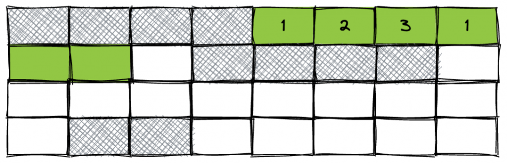

這就是我說的佔位置啦！Rust 看到你 `push` 了一次，猜大概有一就有二、無三不成禮，所以就乾脆先給你加倍的容量，先把格子佔下來，接連著 `push` 兩次也不用擔心後面沒空位。

不過推到滿之後再繼續推的話，Rust 會再去幫你要更大的空間，這回佔位置會佔更兇，一口氣先佔到 12 個位置下了來！如果又滿怎麼辦？就再加倍佔更大的空間...

這是 Rust 的 Vector 的預設行為，但如果你知道大概會用多少，你也可以自己指定容量：

```rust
let rooms: Vec<u8> = Vec::with_capacity(20);
println!("{}, {}", rooms.len(), rooms.capacity());  // 印出 0, 20

```

先卡一個比較大的空間，滿了就會自己再增加容量。

在寫一般的網頁程式的時候，通常不需要去煩惱 Stack 或是 Heap 是什麼東西，但用 Rust 這種主要用來撰寫系統程式的程式語言，就得多考慮這些細節了。


