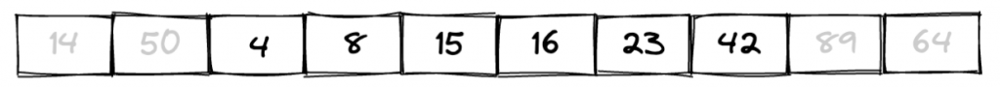
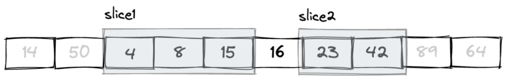

可以使用 `&` 或是 `&mut` 的方式去借（Borrow）資源來用，因為是借來的所以資源的「所有權（Ownership）」不會改變。在上個章節我用「圖書館借書」的比喻其實有些不太精準，就以「借書」這個行為來比喻沒問題，不過圖書館的書不管能不能被劃線（mutable），因為實體物理限制的關係一次也只能借給一個人，但以 Rust 裡的 Vector 來說沒這種物理限制，只要是 immutable 的話一次可以出借給許多人，唯一的規定就是一次只能有一個 mutable 的參照。

在 Rust 裡「借」東西的時候，有時候候並不需要參照到整塊資料，也許只需要其中的一小塊，Rust 也可以讓你借一小片就好，想跟大家介紹的，切片（Slice）。

假設有一塊連續的記憶體位置，上面已經有放了一些資料在上面，你可以想像那個畫面大概長這樣：



雖然 Slice 的翻譯是「切片」，但這個切不是並不是真的讓你「切」一塊肉下來。Slice 比較像窗戶的概念，這個世界很大，但你從窗戶看出去只會看到部份的風景。



例如上圖中的 `slice1` 會看到第 2 ~ 4 格，而 `slice2` 則是只看到 6 ~ 7 這兩格的資料：再次提醒，Slice 只是建立一個參照到某個資料的範圍，你可以透過這個「範圍」取用參照到的內容。

如果用程式碼來的表示的話，大概會是這個樣子：

```rust
let lost_numbers = [4, 8, 15, 16, 23, 42];
let slice1 = &lost_numbers[0..3];
let slice2 = &lost_numbers[4..6];

println!("{:?}", slice1);  // 印出 [4, 8, 15]
println!("{:?}", slice2);  // 印出 [23, 42]

```

利用我們在上個章節學到的「所有權（Ownership）」跟「借（Borrow）」的概念，`slice1` 是一個只能看到 4、8、15 的小視窗，`slice2` 就是可以看到 23 跟 42 這兩格的小視窗。其中 `&lost_numbers[0..3]` 的 `&` 符號表示你要建立一個 Slice，這個 Slice 會指從索引值 `0` 開始算到索引值 `3`，但不包括 `3`，也就是說其實就是只有算到索引值 `2` 而已。同理，`&lost_numbers[4..6]` 這個小窗戶只有開到讓你能看到索引值 `4` 跟 `5` 而已。

Slice 可以從字串、陣列或 Vector 之類的資料型態「切」一小塊出來，它一樣也有 `.len()` 可以用，但就沒有 `.capacity()` 了，因為它就只是個參照而已，它沒有什麼容量的問題。


### 省略索引值

如果省略部份的索引值，`[..2]` 表示從 0 開始到 `2` 但不包括 `2`，`[3..]` 的話則是從 `3` 開始到最後為止：

```rust
let lost_numbers = vec![4, 8, 15, 16, 23, 42];
let first_two_nums = &lost_numbers[..2];  // 前 2 個
let last_three_nums = &lost_numbers[lost_numbers.len() - 3..];  // 後 3 個

println!("{:?}", first_two_nums); // 印出 [4, 8]
println!("{:?}", last_three_nums); // 印出 [16, 23, 42]

```

猜猜看，如果頭尾都省略，像這樣：

```rust
let numbers = &lost_numbers[..];

```

這個切片的窗戶會開多大呢？

切片可以修改嗎？
--------

切片本身只是個參照，所以切片本身沒什麼好修改的，所以這個問題更精準的說，應該是「可以透過切片修改原本的資料嗎」。要的話也是可以，先看看這段範例：

```rust
let mut lost_numbers = vec![4, 8, 15, 16, 23, 42];
let nums = &lost_numbers[0..3];

nums[0] = 123;

```

雖然 `lost_numbers` 本身是一個可以修改的 Vector，但在跟它借的時候是用 immutable 的方式借的，所以 `nums[0]` 這樣的操作會發生錯誤。但如果是用 `&mut` 的方式借的話：

```rust
let mut lost_numbers = vec![4, 8, 15, 16, 23, 42];
let nums = &mut lost_numbers[0..3];

nums[0] = 5566;
println!("{:?}", lost_numbers); // 印出 [5566, 8, 15, 16, 23, 42]

```

這樣就不會出錯了。

因為 `nums` 切片其實就是指向 `lost_numbers` 的某一段的資料，它並不是複製品，所以當原本的 `lost_numbers` 是可以 `mut` 加上又用 `&mut` 方式去做切片，對 `nums` 進行修改的時候也等於是對 `lost_numbers` 進行修改。


字串不是字串？
-------

各位在其它程式語言裡常常在寫的「字串」，在 Rust 裡可能不是你想像的那樣。先來看一段程式碼範例：

```rust
fn main() {
    let book = "為你自己學 Rust";
    publish_book(book);
}

fn publish_book(book: String) {
    println!("{:?} 要上市囉！", book)
}

```

`publish_book()` 函數會接一個 `String` 型別的參數，然後就把收到的參數印出來。這裡我用雙引號做了一個字串，然後傳進去，看起來沒什麼問題，但執行之後 Rust 又很不厭其煩的給你錯誤訊息：

```shell
$ cargo run
error[E0308]: mismatched types
  |
3 |     publish_book(book);
  |     ------------ ^^^^- help: try using a conversion method: `.to_string()`
  |     |            |
  |     |            expected `String`, found `&str`
  |     arguments to this function are incorrect

```

錯誤訊息竟然是型別錯誤。為什麼？不是明明給字串型別嗎？仔細看錯誤訊息就會發現，其實用雙引號（String Literal）包起來所建立的字串不是真的字串，它只是一個字串切片而已。如果要讓上面的程式正常運作，要改一下 `publish_book()` 函數的參數型別：

```rust
fn publish_book(book: &str) {
    println!("{:?} 要上市囉！", book)
}

```

其中 `&str` 就是那個字串切片的型別。其實 Rust 的字串挺複雜的。

切片的型別？
------

Slice 就只是一個參照，它參照到某一段連續的資料，所以切片的型別就是它所參照到的資料的型別。我們先來看看底下這段範例：

```rust
let scores = [88, 12, 39, 15, 10, 28, 92];
let group1 = &scores[0..2]; // [88, 12]
let group2 = &scores[2..];  // [39, 15, 10, 28, 92]

println!("{}", calc_score(group1));
println!("{}", calc_score(group2));

```

這裡把分數分成了兩群，如果我想要寫一個 `calc_score()` 函數來計算這兩群的總得分該怎麼寫？或說，這個 `calc_score()` 函數要接什麼樣的參數？你可以這樣寫：

```rust
fn calc_score(scores: &[u16]) -> u16 {
    scores.iter().sum()
}

```

`&[u16]` 表示傳進來的參數是個陣列型的切片，前面的 `&` 表示它是一種參照型別，裡面的 `u16` 則是表示陣列裡的型別。知道這概念之後，上個段落提到的 `publish_book(book: &str)` 應該也就能看的懂了。

另外，在 Rust 裡要建立一個字串有好幾種方式，其中一種寫法這樣：

```rust
let book: String = String::from("為你自己學 Rust");
println!("{}", book);

```

這個 `book` 就是一個真正的字串型別（String）。但那個 `String::from()` 函數是什麼？如果你去翻它的原始程式碼，你會發現這個 `from()` 函數是這樣寫的：

```rust
fn from(s: &str) -> String {
    s.to_owned()
}

```

它會收一個 `&str` 字串切片，並回傳一個 `String` 型別。所以當你呼叫 `String::from("為你自己學 Rust");` 的時候，傳進去的 `"為你自己學 Rust"` 本身就只是個字串接片，但這個 `from()` 函數會再把它轉換成原本這個切片所對照片的字串，然後再透過 `.to_owned()` 函數把它的所有權給搶過來。
