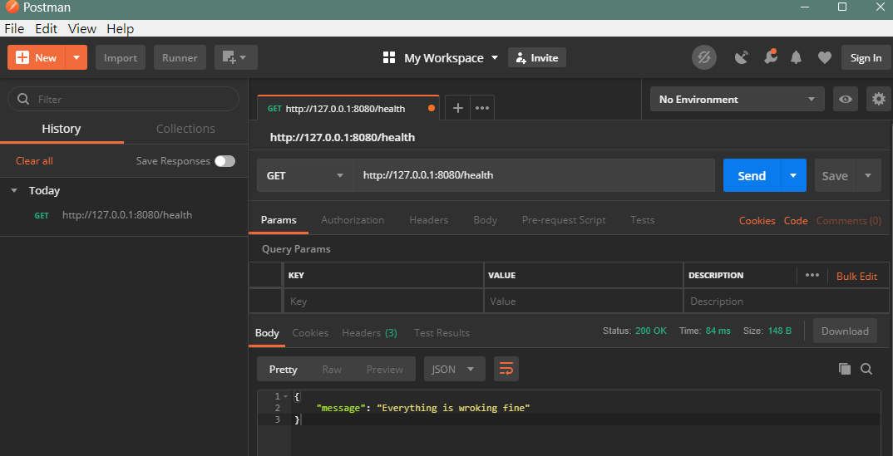

# 前言
  在當今的網路開發中，REST API 已成為許多應用程式和系統之間交互的主要方式。Actix Web，作為一個高效能的 Rust 網頁框架，提供了建立這些 API 的強大工具。

本文章將會帶你走過使用 Actix Web 建立 REST API 的整個過程，從專案的初始化到實作 Todo List 的 CRUD API。

建立新專案
-----

開始新增一個專案吧！專案名稱這裡就用 actix_todo，在終端機執行：

```bash
cargo new actix_todo

```

建立完專案後，接下來這個專案還需要安裝以下幾個套件：

-   [actix-web](https://crates.io/crates/actix-web): Actix Web 是一個高效能、非常靈活的 Rust 網頁框架。可以建立網頁伺服器、客戶端。
    
-   [serde](https://crates.io/crates/serde): Serde 是一個 Rust 的序列化框架，允許將複雜的數據結構轉換成為像是 JSON 這樣的簡單格式，並且還能從這些格式中反序列化回 Rust 的數據結構。在許多 REST API 的實作中，Serde 是不可或缺的工具，因為它使得數據的交換變得非常簡單。
    
-   [chrono](https://crates.io/crates/chrono): Chrono 是一個處理日期和時間的 Rust 函式庫。它提供了日期、時間、日期時間、時區等功能，非常適合在需要時間戳記或日期操作的情境中使用。
    
-   [uuid](https://crates.io/crates/uuid): UUID 函式庫允許生成和解析唯一的通用識別碼 (UUID)。在許多系統中，UUIDs 常被用作唯一識別資源或物件，特別是當傳統的自動遞增 ID 不適用或不夠安全時。

安裝方式只要在終端機分別執行以下指令：

```bash
cargo add actix-web
cargo add serde --features derive
cargo add chrono --features serde
cargo add uuid --features v4
```
建立第一支
-----

### 1. 引入所需的模組和函式庫

```rust
use actix_web::{get, web, App, HttpResponse, HttpServer, Responder, Result};
use serde::{Serialize};

```

第一步要先引入 Actix Web 框架中所需的各種元件，以及 Serde 的序列化功能。

### 2. 定義回應結構

```rust
#[derive(Serialize)]
pub struct Response {
    pub message: String,
}

```

這裡我們定義了一個名為 `Response` 的結構，它包含一個公開的 `message`，型別為 String。`#[derive(Serialize)]` 是一個標記，它讓 `Response` 結構可以被自動序列化為 JSON 格式。

### 3. 定義健康檢查路由

```rust
#[get("/health")]
async fn healthcheck() -> impl Responder {
    let response = Response {
        message: "Everything is working fine".to_string(),
    };
    HttpResponse::Ok().json(response)
}

```

這段程式碼定義了一個非同步的 `healthcheck` 函式，這個函式會回應一個表示 API 運作正常的訊息。`#[get("/health")]` 是一個路由標記，當使用者訪問 `/health` 路徑時，這個函式會被呼叫。函式中，我們建立了一個 `Response` 物件並返回了一個 HTTP 200 OK 的回應，包含該訊息。

### 4. 定義未找到的路由

```rust
async fn not_found() -> Result<HttpResponse> {
    let response = Response {
        message: "Resource not found".to_string(),
    };
    Ok(HttpResponse::NotFound().json(response))
}

```

當其他路由不符合的時候，這個函式將被呼叫。它回應一個 HTTP 404 Not Found 的回應，包含一個表示資源未找到的訊息。

### 5. 主函式

```rust
#[actix_web::main]
async fn main() -> std::io::Result<()> {
    HttpServer::new(|| App::new().service(healthcheck).default_service(web::route().to(not_found)))
        .bind(("127.0.0.1", 8080))?
        .run()
        .await
}

```

最後在整個程式的入口點 \- main。`#[actix_web::main]` 是一個特殊的標記，使得非同步函式可以作為主函式使用。在 `main` 中，我們建立了一個 HTTP 伺服器，指定了 `/health` 路由到 `healthcheck()`，並設定了預設路由到 `not_found()`。 
最後，伺服器被綁定到本地的 `127.0.0.1`，端口 8080，並啟動它。

在終端機執行：

```bash
cargo run
```



模組化開發
-----

隨著我們進一步深入 Actix Web 和 Rust，我們將會遇到越來越多的程式碼。在這種情況下，簡單地將所有功能和結構都放在一個檔案中可能會讓事情變得混亂。

在 Rust 中，模組系統允許我們將代碼分割成小的、可管理的單位，每個單位都具有明確的職責。這不僅使我們的應用程式結構更加清晰，還可以更容易地重複使用和測試特定的功能模組。

在接下來的部分，我們會示範如何使用 Rust 的模組系統來組織 Actix Web 專案，並且會繼續新增其他 API。

在開始模組化開發之前，我們要先新增幾個資料夾跟檔案。

```awk
mkdir src/api src/models src/repository
touch src/api/mod.rs src/models/mod.rs src/repository/mod.rs
```

在 `main.rs` 引入 mod:

```rust
use actix_web::{get, web, App, HttpResponse, HttpServer, Responder, Result};
use serde::Serialize;

mod api;
mod models;
mod repository;

#[derive(Serialize)]
pub struct Response {
    pub message: String,
}
```
開始 Todo List 的 API Endpoint
---------------------------

### A. 建立 Todo 的資料 Model

我們在 `src/models` 目錄下建立一個新的 `todo.rs`，要建立 Todo 的資料 Model，代表一個待辦事項。會用到 `chrono` 和 `serde`，分別處理時間還有 JSON 格式。

```rust
// src/models/todo.rs
use chrono::prelude::{DateTime, Utc};
use serde::{Deserialize, Serialize};

#[derive(Serialize, Deserialize, Debug, Clone)]
pub struct Todo {
    pub id: Option<String>,
    pub title: String,
    pub description: Option<String>,
    pub created_at: Option<DateTime<Utc>>,
    pub updated_at: Option<DateTime<Utc>>,
}

```

接著在 `src/models/mod.rs` 做一個模組聲明：

```rust
pub mod todo;
```

### B. 定義一個內存資料庫來存儲 Todo 物件

由於本文章的範例沒有使用像是 PostgreSQL 之類的資料庫來做存取，比較著重在 REST API 的示範，所以我們會自己定義一個簡單的內存資料庫來示範。

在 `src/repository` 目錄下建立一個新的 `database.rs`

#### 1. 引入所需的模組和函式庫

```rust
use std::fmt::Error;
use chrono::prelude::*;
use std::sync::{Arc, Mutex};
use crate::models::todo::Todo;

```

這些 use 聲明引入了：

-   錯誤格式化功能。
-   日期和時間相關的功能。
-   Arc 和 Mutex，這是 Rust 中的同步原語，用於多線程共享和修改資料。
-   從 models 模組引入的 Todo 結構。

#### 2. 定義資料庫結構

```rust
pub struct Database {
    pub todos: Arc<Mutex<Vec<Todo>>>,
}

```

`Database` 結構具有一個公開的字段 `todos`，它是一個受 `Mutex` 保護的 `Todo` 物件的向量，這表示可以在多線程環境中安全地修改它。

#### 3. 為資料庫結構實現功能

```rust
impl Database {
    pub fn new() -> Self {
        let todos = Arc::new(Mutex::new(vec![]));
        Database { todos }
    }

    pub fn create_todo(&self, todo: Todo) -> Result<Todo, Error> {
        let mut todos = self.todos.lock().unwrap();
        let id = uuid::Uuid::new_v4().to_string();
        let created_at = Utc::now();
        let updated_at = Utc::now();
        let todo = Todo {
            id: Some(id),
            created_at: Some(created_at),
            updated_at: Some(updated_at),
            ..todo
        };
        todos.push(todo.clone());
        Ok(todo)
    }
}

```

這個 `impl` 區塊為 `Database` 結構增加了功能和方法。

-   `new` 方法創建一個新的 `Database` 實例，其中 `todos` 是一個空向量。
    
-   `create_todo` 方法將一個新的 `Todo` 物件加入到 `todos` 向量中。該方法生成一個新的 UUID 作為 ID，設置當前的 UTC 日期和時間作為新增和更新時間，然後將 `Todo` 物件加入到向量中。
    

#### 4. 在 `src/repository/mod.rs` 中的模組聲明

```rust
pub mod database;
```

### C. 定義與 Todo 相關的 API 端點

在 `src/api` 目錄下建立一個新的 `api.rs`

#### 1. 引入所需的模組和函式庫

```rust
use actix_web::web;
use actix_web::{web::{Data, Json}, post, HttpResponse};
use crate::{models::todo::Todo, repository::database::Database};

```

這些 `use` 主要引入了：

-   Actix Web 的核心組件，用於建立 Web 應用。
-   用於資料提取和反序列化 JSON 數據的功能。
-   從專案中引入的 `Todo` 結構和 `Database` 模組。

#### 2. 定義 API Endpoint

```rust
#[post("/todos")]
pub async fn create_todo(db: Data<Database>, new_todo: Json<Todo>) -> HttpResponse {
    let todo = db.create_todo(new_todo.into_inner());
    match todo {
        Ok(todo) => HttpResponse::Ok().json(todo),
        Err(err) => HttpResponse::InternalServerError().body(err.to_string()),
    }
}

```

這是一個異步的函式，用於新增一個新的待辦事項。它期望從 HTTP POST 請求的正文中接收一個 JSON 格式的 `Todo` 物件。主要接受兩個參數： 
- Database 的參考。 
- 客戶端提供的新的 Todo 物件。

會建立新的待辦事項並返回適當的 HTTP 響應。

#### 3. 配置 API

```rust
pub fn config(cfg: &mut web::ServiceConfig) {
    cfg.service(
        web::scope("/api")
            .service(create_todo)
    );
}


```

這個 `config()` 接受一個 `ServiceConfig` 的參考，並將 API Endpoint 加入它。在此例中，它將 `create_todo()` 設置為在 `/api/todos` 路徑上響應。

#### 4. 在 `src/api/mod.rs` 中的模組聲明

```rust
pub mod api;

```

這行程式碼將 `src/api/api.rs` 文件作為一個公開的子模組 api 引入到 `src/api` 模組中。這樣，其他 Rust 代碼可以訪問和使用在 api 子模組中定義的所有公開功能。

最後則是在 `main.rs` ：

```rust
#[actix_web::main]
async fn main() -> std::io::Result<()> {
    let todo_db = repository::database::Database::new();
    let app_data = web::Data::new(todo_db);

    HttpServer::new(move ||
        App::new()
            .app_data(app_data.clone())
            .configure(api::api::config)
            .service(healthcheck)
            .default_service(web::route().to(not_found))
            .wrap(actix_web::middleware::Logger::default())
    )
        .bind(("127.0.0.1", 8080))?
        .run()
        .await
}

```

然後執行 `cargo run`，就可以進行測試了。


繼續新增其他的 Endpoint。

GET /todos
----------

在 `src/api/api.rs` 新增函式：

```rust
use actix_web::{web::{
    Data,
    Json,
}, post, get, HttpResponse};

// 省略

#[get("/todos")]
pub async fn get_todos(db: web::Data<Database>) -> HttpResponse {
    let todos = db.get_todos();
    HttpResponse::Ok().json(todos)
}

pub fn config(cfg: &mut web::ServiceConfig) {
    cfg.service(
        web::scope("/api")
            .service(create_todo)
            .service(get_todos)
    );
}

```

然後要實現 `get_todos`，在 `src/repository/database.rs`：

```rust
impl Database {
    // 省略

    pub fn get_todos(&self) -> Vec<Todo> {
        let todos = self.todos.lock().unwrap();
        todos.clone()
    }
}

```

GET /todos/\{id\}
---------------

也是先在 `src/api/api.rs` 新增：

```rust
#[get("/todos/{id}")]
pub async fn get_todo_by_id(db: web::Data<Database>, id: web::Path<String>) -> HttpResponse {
    let todo = db.get_todo_by_id(&id);
    match todo {
        Some(todo) => HttpResponse::Ok().json(todo),
        None => HttpResponse::NotFound().body("Todo not found"),
    }
}

pub fn config(cfg: &mut web::ServiceConfig) {
    cfg.service(
        web::scope("/api")
            .service(create_todo)
            .service(get_todos)
            .service(get_todo_by_id)
    );
}

```

然後在 `src/repositorydatabase.rs` 實現 `get_todo_by_id`

```rust
impl Database {
    // 省略

    pub fn get_todo_by_id(&self, id: &str) -> Option<Todo> {
        let todos = self.todos.lock().unwrap();
        todos
            .iter()
            .find(|todo| todo.id == Some(id.to_string()))
            .cloned()
    }
}

```

PUT /todos/\{id\}
---------------

在 `src/api/api.rs` 新增：

```rust
use actix_web::{
    get, post, put,
    web::{Data, Json},
    HttpResponse,
};

// 省略

#[put("/todos/{id}")]
pub async fn update_todo_by_id(
    db: web::Data<Database>,
    id: web::Path<String>,
    updated_todo: web::Json<Todo>,
) -> HttpResponse {
    let todo = db.update_todo_by_id(&id, updated_todo.into_inner());
    match todo {
        Some(todo) => HttpResponse::Ok().json(todo),
        None => HttpResponse::NotFound().body("Todo not found"),
    }
}

pub fn config(cfg: &mut web::ServiceConfig) {
    cfg.service(
        web::scope("/api")
            .service(create_todo)
            .service(get_todos)
            .service(get_todo_by_id)
            .service(update_todo_by_id),
    );
}

```

在 `src/repository/database.rs` 實現 `update_todo_by_id`

```rust
impl Database {
    // 省略

    pub fn update_todo_by_id(&self, id: &str, todo: Todo) -> Option<Todo> {
        let mut todos = self.todos.lock().unwrap();
        let updated_at = Utc::now();
        let todo = Todo {
            id: Some(id.to_string()),
            updated_at: Some(updated_at),
            ..todo
        };
        let index = todos
            .iter()
            .position(|todo| todo.id == Some(id.to_string()))?;
        todos[index] = todo.clone();
        Some(todo)
    }
}

```

DELETE /todos/\{id\}
------------------

```rust
use actix_web::{
    delete, get, post, put,
    web::{Data, Json},
    HttpResponse,
};

// 省略

#[delete("/todos/{id}")]
pub async fn delete_todo_by_id(db: web::Data<Database>, id: web::Path<String>) -> HttpResponse {
    let todo = db.delete_todo_by_id(&id);
    match todo {
        Some(todo) => HttpResponse::Ok().json(todo),
        None => HttpResponse::NotFound().body("Todo not found"),
    }
}

pub fn config(cfg: &mut web::ServiceConfig) {
    cfg.service(
        web::scope("/api")
            .service(create_todo)
            .service(get_todos)
            .service(get_todo_by_id)
            .service(update_todo_by_id)
            .service(delete_todo_by_id),
    );
}

```

在 `src/repository/database.rs` 實現 `delete_todo_by_id`

```rust
impl Database {
    // 省略

    pub fn delete_todo_by_id(&self, id: &str) -> Option<Todo> {
        let mut todos = self.todos.lock().unwrap();
        let index = todos
            .iter()
            .position(|todo| todo.id == Some(id.to_string()))?;
        Some(todos.remove(index))
    }
}

```

在這篇文章中，我們示範了如何使用 Actix Web 建立 REST API 。Actix Web 不僅為 Rust 開發者提供了強大的工具，還確保了我們的 API 具有卓越的性能和靈活性。隨著 Rust 在網頁開發領域的逐步崛起，相信 Actix Web 會成為更多開發者的首選。

