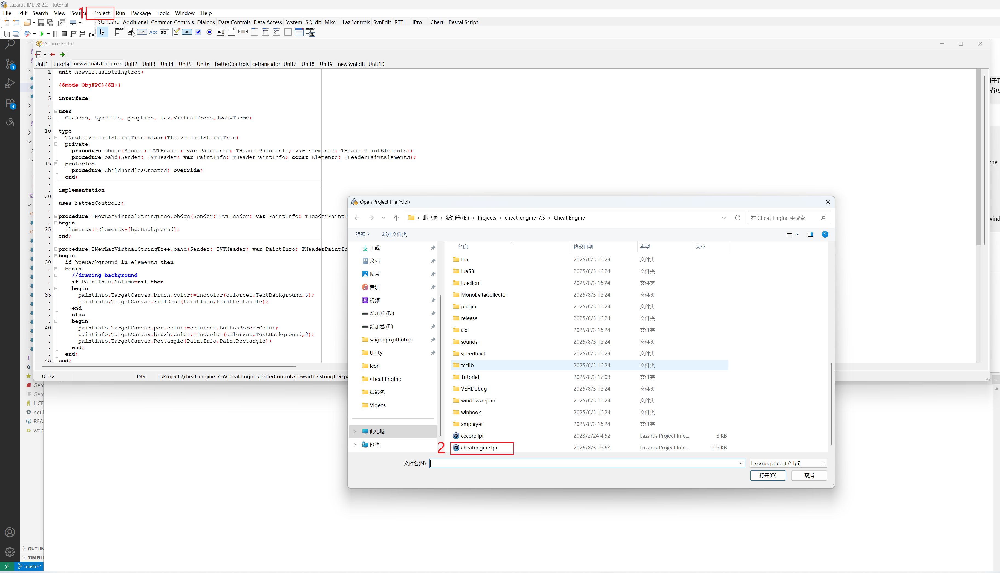
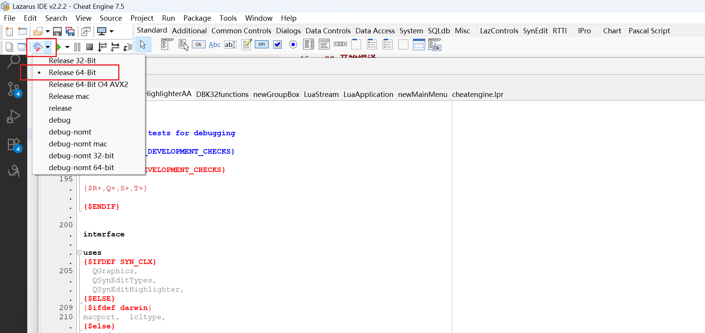
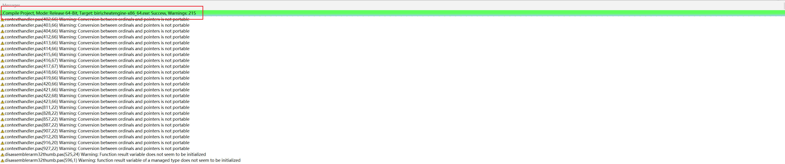
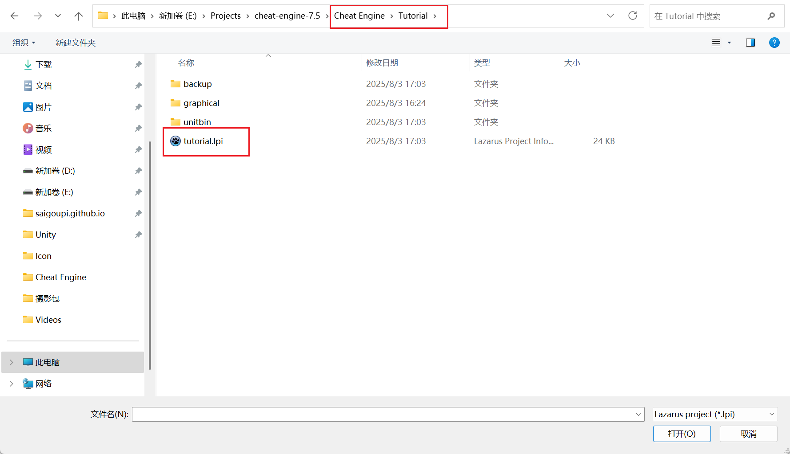
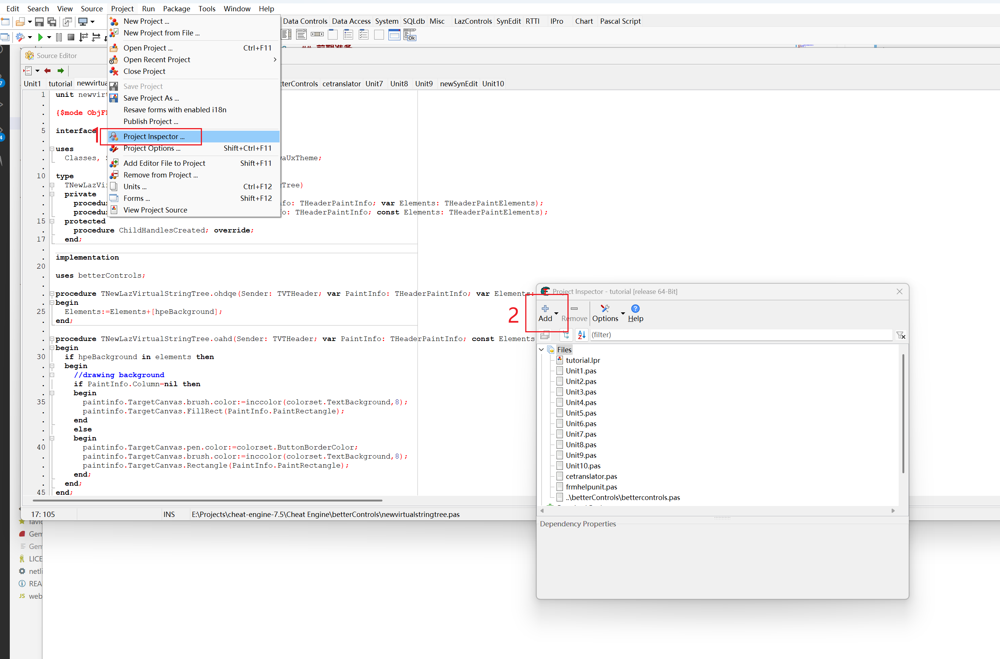
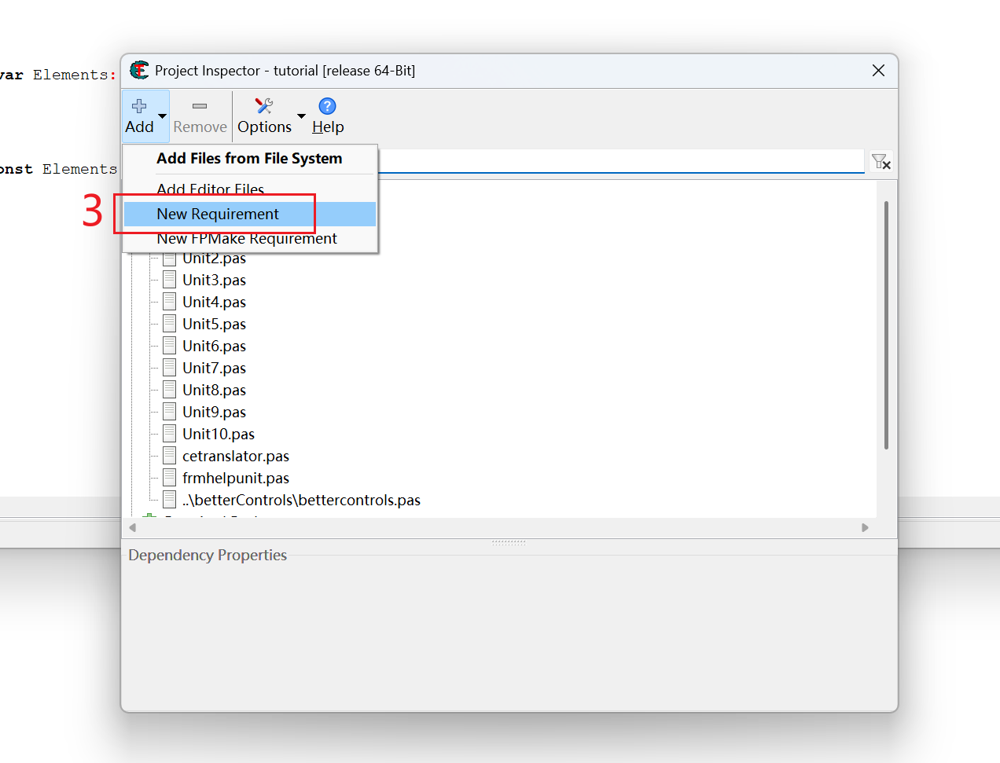
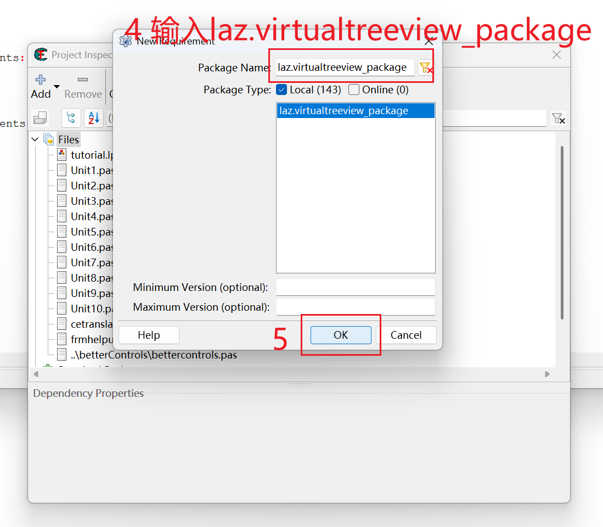
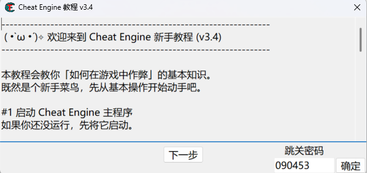

本地編譯CE？記錄一下
<!--truncate-->
# 為什麼要本地編譯CE？#
Cheat Engine（CE）是一個記憶體操控工具，可以透過修改掃描內存，並修改指定記憶體的數值的方式來修改遊戲內數值，達到作弊的效果。大部分人都是用其來進行單機遊戲的數值修改，我最近在玩怪物獵人荒野，到後期實在是不想刷了，於是也開始研究這些作弊工具。

CE官方其實提供了安裝文件，不用自己編譯。可是看網上說這個安裝程序，會捆綁安裝一些其他的流氓軟體（可以在安裝時通過勾選不安裝），本來我對CE這類“開掛軟體”就不太了解，所以還是有一些防備心理的。 CE官方安裝程式捆綁一些軟體，也是為了生計著想，畢竟人家是免費開源軟體。

另外，CE的Github上也有本地編譯的步驟說明，稍微研究一下，發現整個過程也很簡單。有源碼，有教程，本地編一下其實也很快，而且還更加放心。

# 前期準備
CE的Github官方庫下載最新的release原始碼

[cheat-engine官方Git倉庫](https://github.com/cheat-engine/cheat-engine/releases/#release-7.5)

根據官方的README要求，下載LazarusIDE

[Lazarus官方下載](https://sourceforge.net/projects/lazarus/files/Lazarus%20Windows%2064%20bits/Lazarus%202.2.2/)

>info "Lazarus是什麼？"
>Lazarus 並不是一個編譯器，而是一個Free Pascal 編譯器的整合開發環境(IDE)。它基於Free Pascal 編譯器，用於開發跨平台的應用程序，特別是使用Object Pascal 語言的圖形使用者介面(GUI) 應用程式。簡單來說，Lazarus 提供了一個視覺化介面，讓開發者可以像使用Delphi 一樣方便地開發應用程序，而背後實際執行編譯工作的，是Free Pascal 編譯器。

按照以下要求分別下載兩個exe安裝文件

>The default installer is:
>
>lazarus-2.2.2-fpc-3.2.2-win64.exe
>
>You should download this file, if you want to work on any Windows 64 bit version.
>The installers include FPC 3.2.2.2 and they include the Lazarus help files.
>
>Add-On for building and debugging 32bit Windows applications:
>
>lazarus-2.2.2-fpc-3.2.2-cross-i386-win32-win64.exe
>
>This file can be installed as add-on to the 64 bit Lazarus IDE (on Systems with Windows 64 bit only), if you wish to develop for 32bit Windows too.

首先執行第一個exe，安裝完畢後，再執行第二個exe安裝額外功能。

# CE軟體編譯
打開Lazarus，工作列中打開Project-> Open Project，在下載的源碼中找到Cheat Engine資料夾下cheatengine.lpi的文件，雙擊就可以打開CE的工程了。


工作列左上角在編譯的地方更換目標版本，win11就用Release 64-Bit即可。


最後工作列點擊Run-> Build就會開始編譯了，顯示綠色Success就是編譯好了，然後到Cheat Engine\bin路徑下，找到cheatengine-x86_64.exe，雙擊運行就會啟動CE軟體了。


# CE教學小遊戲編譯
CE軟體已經可以直接用了，使用教學在網路上一搜一大堆。

另外為了方便用戶入門，CE自己還專門做了一個教程小遊戲，可以讓用戶邊學邊玩，教程也是一個單獨的工程，還是同樣的打開工程，找到路徑Cheat Engine/Tutorial下的tutorial.lpi工程，雙擊打開


和上面同樣的操作，選擇版本後點選編譯，這時可能會有如下報錯:
```
newvirtualstringtree.pas(8,32) Fatal: Cannot find laz.VirtualTrees used by newvirtualstringtree. Check if package laz.virtualtreeview_package is in the dependencies.
```
很簡單，就是專案缺少依賴，請按照以下步驟加入依賴包laz.virtualtreeview_package即可

>Go to "Project" in the top left and then click "Project Inspector".
>Click on the Add button with the plus.
>Select the page New Requirement.
>Write "laz.virtualtreeview_package" into the "Package-Name" field.
>Click Ok.







然後再重新編譯，成功之後在CE軟體的同路徑下，找到tutorial-x86_64.exe，雙擊就可以打開教程小遊戲了


