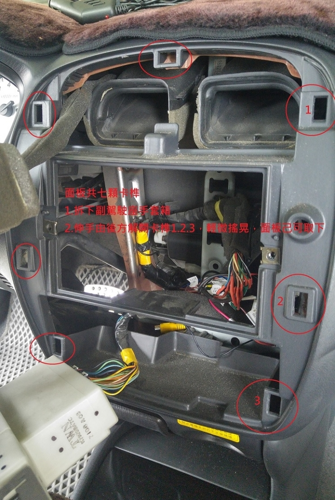
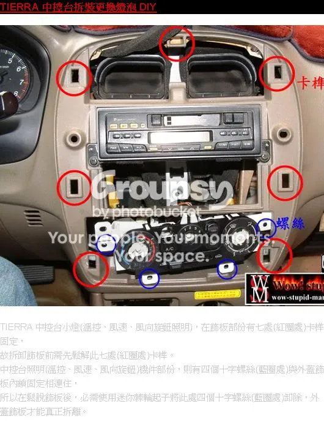
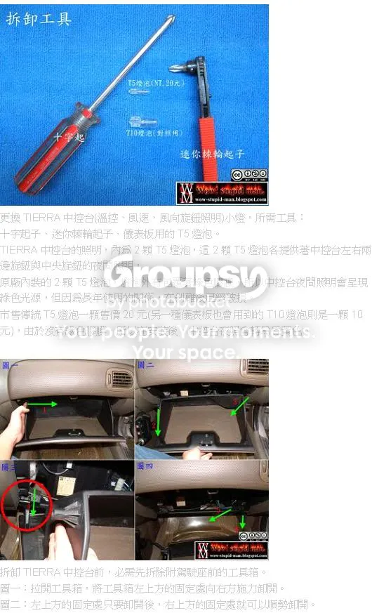
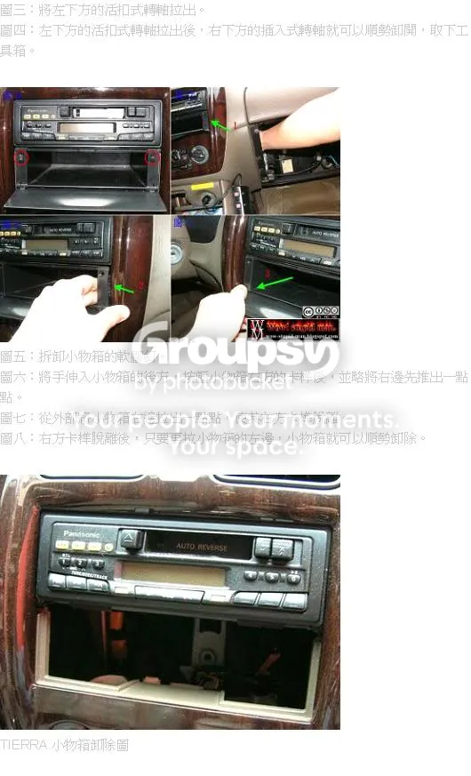
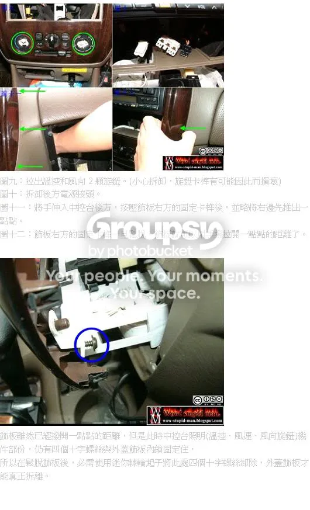
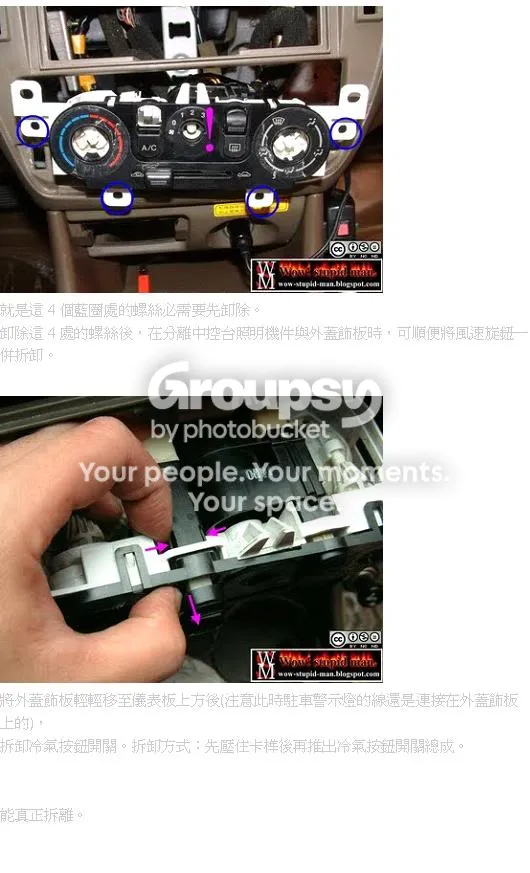
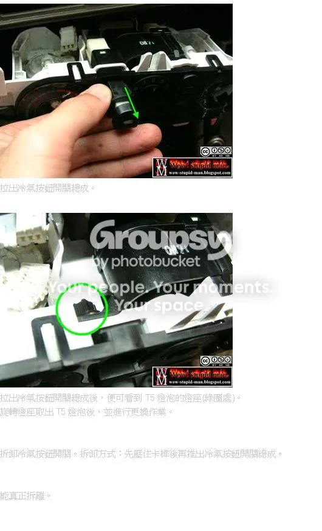
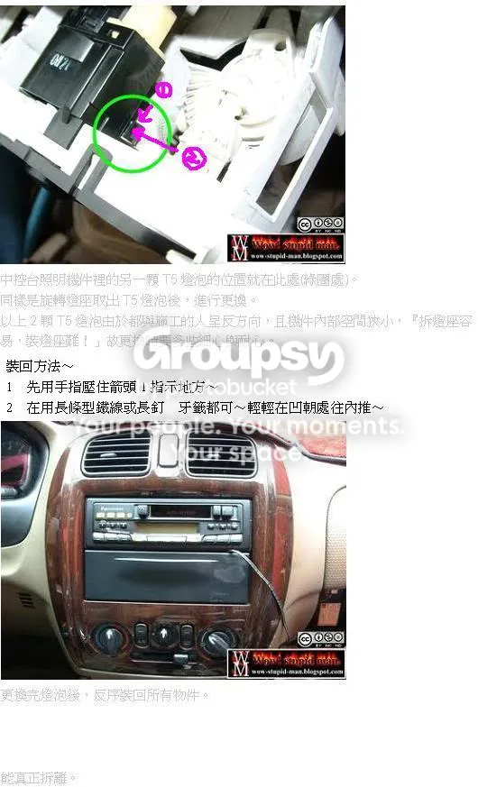

# 前言
來記錄一些有關Ford tierra修理
<!--truncate-->
車型:2004年tierra 1.6 aero 4D/A  
發照:2005年1月  

# 2005 Ford Tierra 原廠音響與安卓機接線定義對照表

本定義適用於 2005 年 Ford Tierra (Aero / XT / SE 等車型)。安裝通用型無線方控與安卓機時，請依據此顏色對照進行並接或跨接。

---

## 1. 電源、控制與方控線路 (Power, Control & SWC)

| 功能說明 | Tierra 原廠車端線色 | 安卓機主線組線色 | 方控接收盒接線方式 |
| :--- | :--- | :--- | :--- |
| **鑰匙啟動電 (ACC)** | **粉紅色底黑條紋** | **紅色** (Red) | 💡 **三線並接**：原廠粉紅黑線 + 安卓機紅線 + 方控盒紅線 |
| **車體接地 (GND)** | **純黑色** | **黑色** (Black) | 💡 **三線並接**：原廠純黑線 + 安卓機黑線 + 方控盒黑線 |
| **電瓶正極 (B+ / 長火線)** | **藍色底紅條紋** | **黃色** (Yellow) | 直接與安卓機黃線對接（提供記憶電路） |
| **小燈偵測 (ILL / 螢幕調暗)** | **淺綠色底黑條紋** | **橘色** (Orange) | 直接與安卓機橘線對接（開大燈時螢幕自動變暗） |
| **天線啟動 (ANT / 放大器)** | **藍色底黃條紋** | **藍色** (Blue) | 直接與安卓機藍線對接（驅動原廠天線放大器） |
| **方控訊號 1 (KEY 1)** | *(原廠無此線)* | **棕色** (Brown) | 💡 **單獨對接**：直接接方控接收盒的訊號線（橘或白） |
| **行動電話靜音 (MUTE)** | **純粉紅色** | *(通常不接)* | 早期原廠預留線，改裝安卓機直接空著並包妥絕緣 |

---

## 2. 喇叭線路 (Speakers)

| 喇叭位置與極性 | Tierra 原廠車端線色 | 安卓機主線組線色 |
| :--- | :--- | :--- |
| **左前喇叭 (＋)** | **黑色底紅條紋** | **純白色** (White) |
| **左前喇叭 (－)** | **黑色底白條紋** | **白底黑條紋** (White/Black) |
| **右前喇叭 (＋)** | **純紅色** | **純灰色** (Gray) |
| **右前喇叭 (－)** | **純白色** | **灰底黑條紋** (Gray/Black) |
| **左後喇叭 (＋)** | **棕色底白條紋** | **純綠色** (Green) |
| **左後喇叭 (－)** | **純棕色** | **綠底黑條紋** (Green/Black) |
| **右後喇叭 (＋)** | **純綠色** | **純紫色** (Purple) |
| **右後喇叭 (－)** | **綠色底橘條紋** | **紫底黑條紋** (Purple/Black) |

---

## 🛠️ DIY 改裝安全注意事項

1. **斷電作業**：接線前建議先將車輛電瓶的**負極（黑頭）**拆開，或確保車鑰匙處於 **OFF** 狀態並拔出，避免接線時不慎短路燒毀車載保險絲或安卓機。
2. **絕緣處理**：所有剪線、剝線並接的節點，請務必使用**電子絕緣膠帶（電火布）**緊密纏繞包覆，或使用**熱縮套管**進行絕緣，防止車輛行駛震動導致裸露線頭互相接觸。
3. **核對標籤**：雖然多數安卓機遵循標準色規，但部分白牌機種可能有異。接線時請以安卓機**機身外殼上的線路定義貼紙**或**線材上的英文標籤（如 KEY1、ACC、B+）**為最終準則。

## 拆中控台
1. 先拆下副駕駛座手套箱，伸手鬆動飾板卡榫，拆下飾板

---

