# 前言
來記錄一些有關Ford tierra修理
<!--truncate-->
車型:2004年tierra 1.6 aero 4D/A  
發照:2005年1月  

零件12V 3mm的毛燈泡
所需工具：小支一字起子、斜口鉗  
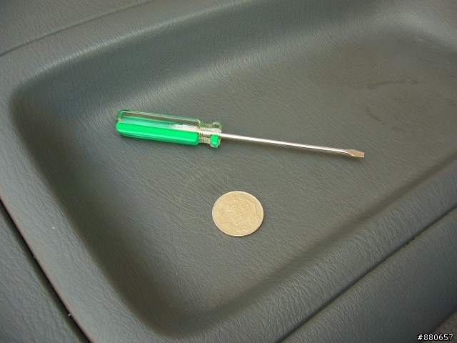

行李廂、霧燈開關，裡面是有燈泡的
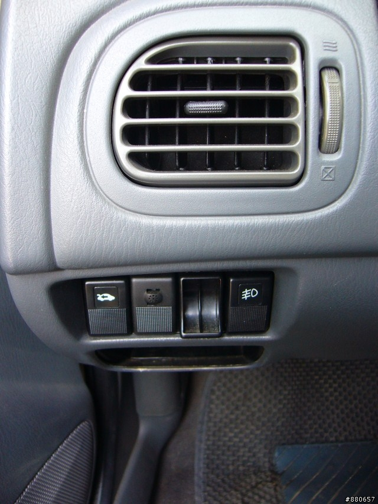

之前還笨笨的從正面挖…看過某blog…從這才對
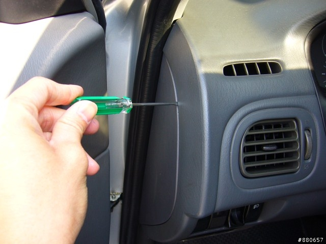

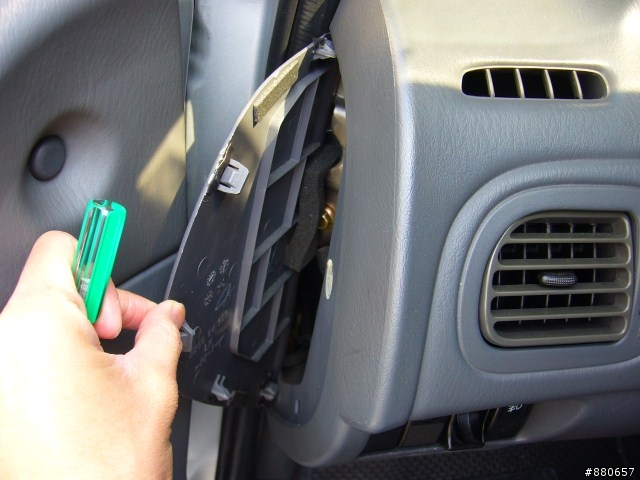

上兩張照片的板子拿下，手伸進去從背後推出來
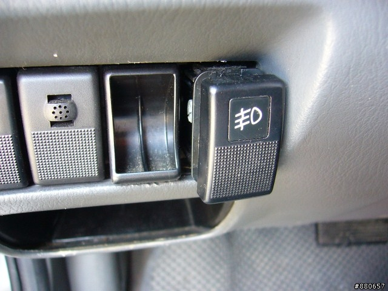

接頭拆開，按鈕總成就下來了
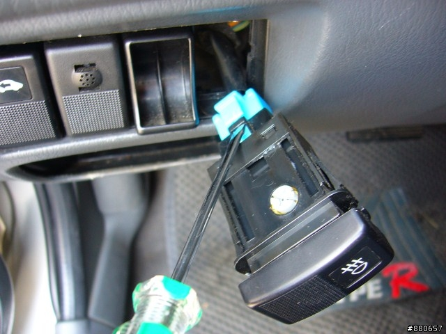

第一次拆下有點嚇一跳…比T牌用的還小
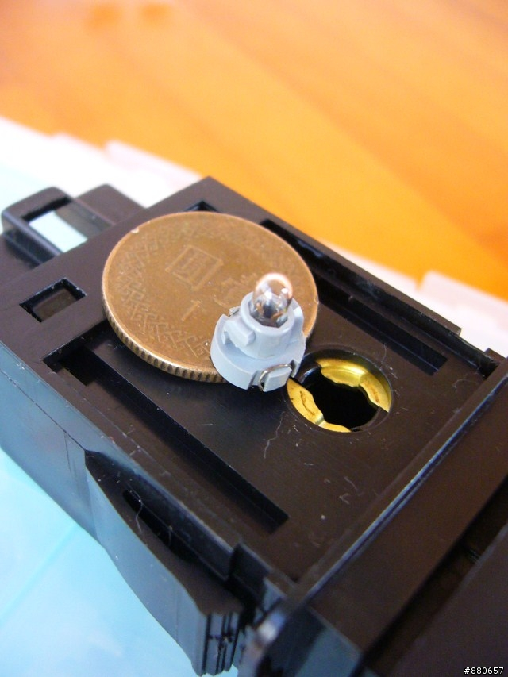

左邊是這台車的3mm / 右邊是T牌用的5mm
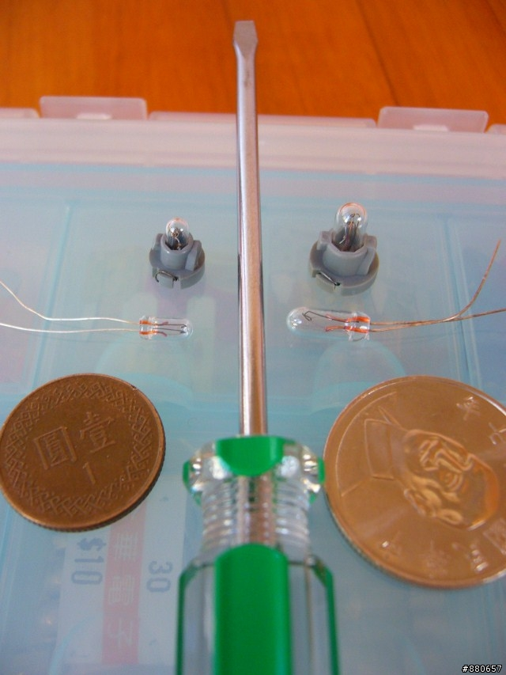

汽材行其實買的到含座的燈泡，我在鄉下的汽材行買一顆竟然要價$100，比我的H4還貴
換毛燈泡很簡單，它只是一顆小燈泡穿過塑膠座，再繞過溝槽
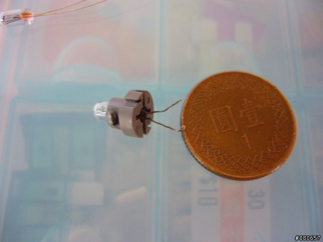

新的燈泡，腳穿過去，繞過後多出來的要剪掉
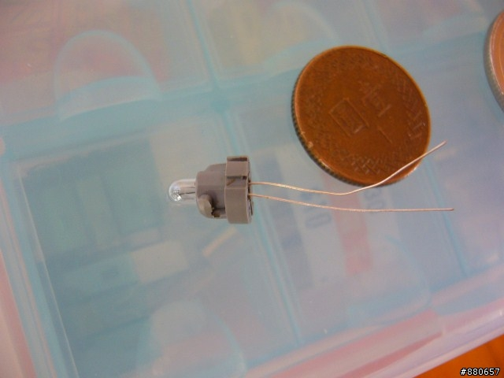

裝回去  
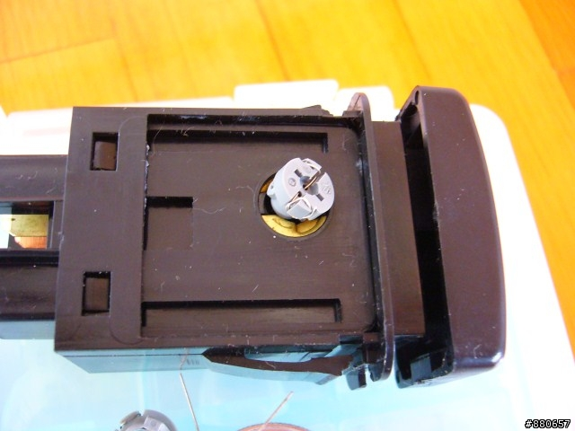